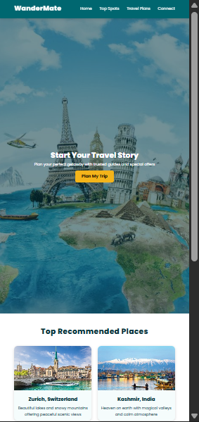
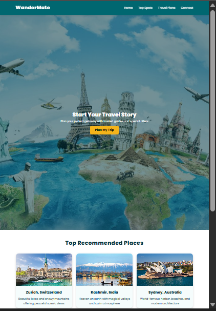
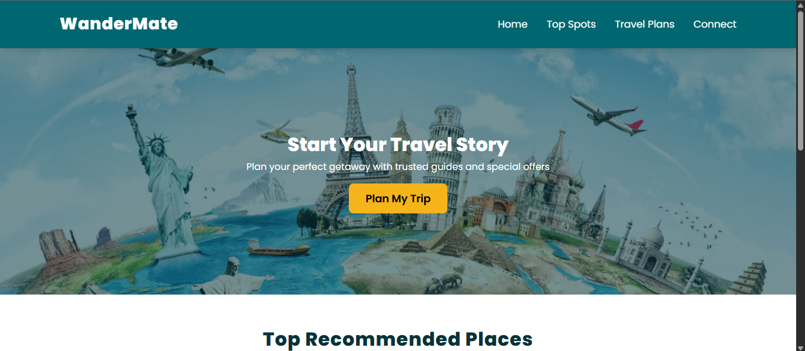

# WanderMate - Travel Agency Website

# Project Theme

Travel Agency Website

# Description

WanderMate is a website that helps users explore travel destinations and book trips easily. The main sections are:

- Header & Navbar: Logo and menu links (Home, Top Spots, Travel Plans, Connect)
- Hero Section: Banner with call-to-action button "Plan My Trip"
- Top Recommended Places: Cards showing popular destinations with images and descriptions
- Best Travel Deals: Travel packages with price, duration, features, and book buttons
- Footer: Basic footer with copyright information

# Layout & Responsiveness

- Techniques Used: Flexbox and CSS Grid  
  Working on:
  - Mobile
  - Tablet
  - Desktop

The website adjusts for all screen sizes. On smaller screens, destination and package cards stack vertically.

## How to Open Locally

1. Download or copy the project folder.
2. Open `capstone.html` in a browser.
3. Keep `cap-style.css` and images in the same folder.

# Screenshots

(I minimized screen size (50%) to capture screenshot of maximum viw of website. As per screen size (100% or 50%) it is responsive.)

orignal view 

